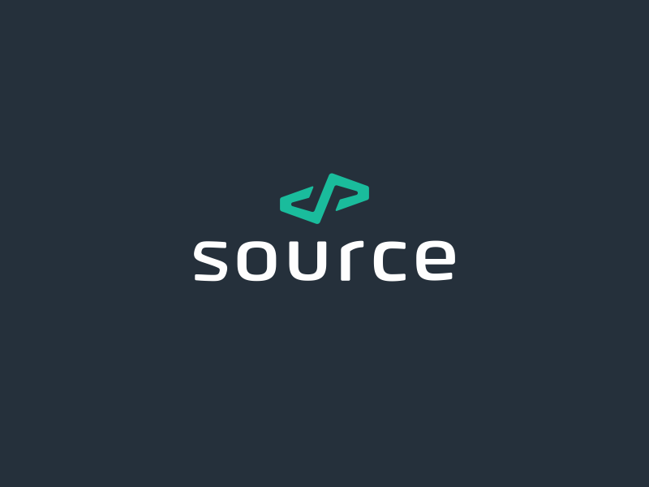

  

# About S.S.C

S-some S-source C-code - Some source code.\
The repository is aimed at storing not particularly important, but possibly interesting source code.

## Preview code

- [RayCasting](src/Python/RayCasting) - 3D visualization project using the idea of ray casting. [_Python_]
- [L-systems](src/Python/L-systems/) - Simple implementation of L-systems visualization. [_Python_]
- [Hello world x86_32bit](src/Assembly/Hello_world_x86_32) - Simple "Hello, World!" on Assembler. [_NASM_]
- [TypeHinting Example for Python](src/Python/TypeHinting) - Examples of the use of different Type Hints. [_Python_]
- [Hello World in different languages](src/HelloWorlds) - The X language examples are located in the X folder in the main file
- [UnixTools](src/UnixTools) - Tutorial copies of GNU programs.
  - [wc](src/UnixTools/wc) - A copy of the wc C program. [_C_]

## Developers

- [Qu1nel](https://github.com/Qu1nel)

## License

[Apache-2.0](./LICENSE) © [Ivan Kovach](https://github.com/Qu1nel/)

This Project Qu1nel.S.S.C in distributive under the **[Apache-2.0 License](./LICENSE)**, and it also uses those codes that are
distributed under the **[Apache-2.0 License](./LICENSE)**.
