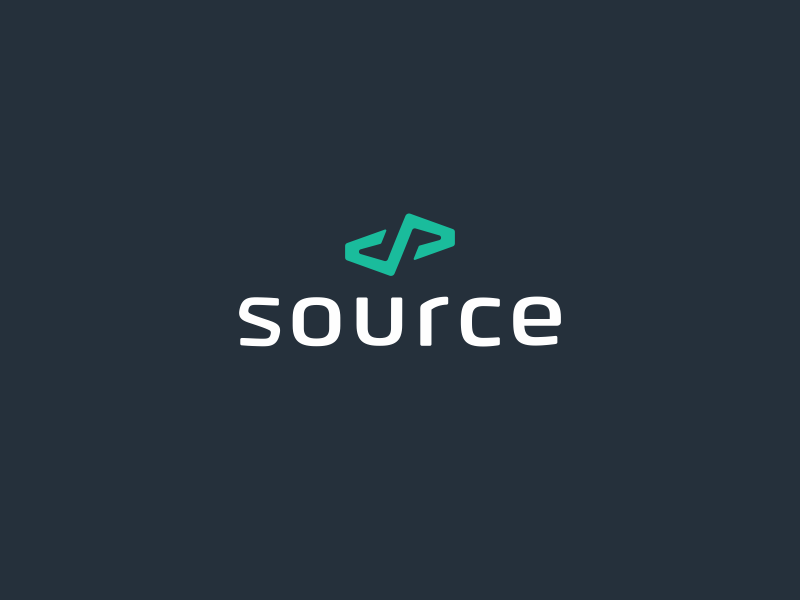

  

# About S.S.C

S-some S-source C-code - Some source code.\
The repository is aimed at storing not particularly important, but possibly interesting source code.

## Preview code

- [L-systems](src/Python/L-systems/) - Simple implementation of L-systems visualization. [Python]
- [RainbowSpiral](src/Python/RainbowSpiral) - The usual script that outputs a rainbow spiral. [Python]
- [RayCasting](src/Python/RayCasting) - 3D visualization project using the idea of ray casting. [Python]
- [Hello world x86_32bit](src/Assembly/Hello_world_x86_32) - Simple "Hello, World!" on Assembler [NASM]

## Developers

- [Qu1nel](https://github.com/Qu1nel)

## License

This Project Qu1nel.S.S.C in distributive under the **[Apache-2.0 License](./LICENSE)**, and it also uses those codes that are
distributed under the **[Apache-2.0 License](./LICENSE)**.
